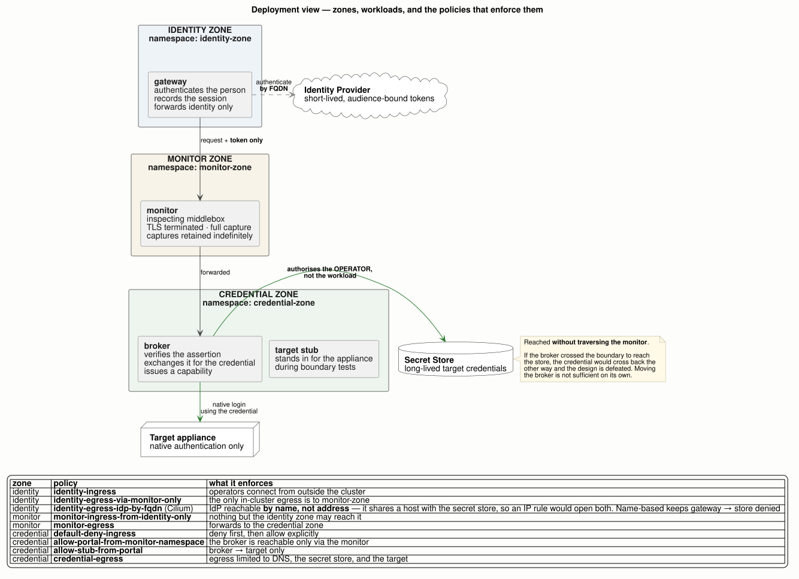

# The Credential Broker Pattern

### Letting modern identity reach systems that only understand passwords, across a boundary that reads everything

Most organisations run two estates. One authenticates people with short-lived tokens.
The other — firewalls, switches, load balancers, storage arrays — understands a username
and a password, and will not change. Between them sits a boundary that decrypts and records
traffic for legitimate security reasons.

This pattern lets a person use their own identity to reach the second estate without a
password ever crossing that boundary, and without the person ever holding one.

Claims are marked **[M]** measured in a working implementation, **[D]** from vendor
documentation, **[A]** reasoned but unverified. Where a control was not proven, it says so.

---

# Part I — The problem

## 1. Why this is hard

Three facts, each reasonable alone:

1. Old equipment authenticates with a **shared, long-lived password**. The vendor's roadmap
   is not yours; this will not change.
2. A boundary **decrypts and records** everything crossing it. Those records are retained
   indefinitely and are not selectively editable after the fact.
3. To manage the equipment, someone must send it that password.

Put together: **to do routine work you must move a password across something that keeps a
permanent copy.**

"It's encrypted in transit" is not an answer. It is decrypted at the boundary by design —
that inspection *is* a security control, and turning it off for this traffic is not an
improvement.

## 2. Why a password is categorically different from a token

This is the crux, and it is not a matter of degree.

| | A short-lived token | A password |
|---|---|---|
| Lifetime in a recording | useless within minutes | valid until someone rotates it |
| Tied to a person | yes | no — shared |
| Revocable | expires by itself | only by changing it everywhere |

> A recording of a token is an artefact. A recording of a password is **an unexpired key,
> held indefinitely, by anyone who can read the archive.**

Everything below follows from that single asymmetry.

## 3. Why the obvious answers fail

**Give the operator the password.** Now access is unattributable — the device sees a shared
account, not a person — and revocation means changing it everywhere it is used.

**Put a proxy in front and inject the password.** If the proxy sits on the near side of the
boundary, the password crosses. The recording problem is unchanged.

**Exempt the traffic from inspection.** Removes a control that exists for good reasons, and
usually is not permitted anyway.

**Use a jump host.** Better for attribution, but the password still lives somewhere a person
can reach, and it still crosses to the device.

## 4. The idea

Split the path at the boundary.

```
operator ──▶ gateway ──▶ [ boundary: records everything ] ──▶ broker ──▶ device
                │                                                │
        authenticates the person,                    exchanges that identity for the
        forwards IDENTITY only                       credential, and uses it here
```

Only the operator's identity crosses. It is short-lived, bound to one person, and worthless
in a recording once it expires. The credential is fetched and used entirely on the far side,
and is never returned to the caller.

**Two rules carry the whole design:**

1. Only expiring, bound, scoped material crosses the boundary.
2. The secret store authorises **the operator**, not the broker's workload identity.

The second rule is what makes access attributable. A vault that authenticates the pod knows a
machine connected. A vault that authenticates the person knows who.

## 5. What you get, and what you do not

**You get:** no password in the boundary's record of the traffic it would otherwise have
travelled in. Access attributable to a person. Revocation that means something, because the
capability the operator holds is short-lived and individual.

**You do not get** a guarantee that nothing sensitive ever crosses. The broker does not read
request bodies and does not restrict what a caller puts in one. Against a careless or hostile
caller this is a partial control. Anyone told otherwise has been over-sold.

**You do not get** coverage of equipment that cannot speak through the boundary at all. That
is a real and separate problem — see §12.

**You do not get** relief from the boundary seeing *who* is asking and *when*. Identity is
not a secret that expires.

## 6. The decision

The pattern is usually already permitted, because everything crossing is a token. The real
question is **who builds and owns it.**

- **Every team builds its own** — many implementations of uneven quality, no common audit,
  and no way to tell which ones hold the property they claim.
- **One is built and shared** — teams onboard by configuration rather than construction.

There is a third option that costs far less and is useful even if nothing is funded:
**publish the test.** The safety property here is measurable (§13). Publishing a conformance
test lets any independent implementation be held to the same bar.

Effort scales with **distinct target types, not target count.** Onboarding the fifth device
of a type you already support is configuration. The first device of a new type is
integration. Estates typically have five to fifteen distinct types.

---

# Part II — The pattern

## 7. Capability, not credential

The caller never receives the credential. It receives a **capability**, bound to three things
and useless outside them:

| Bound to | Meaning |
|---|---|
| **Subject** | the authenticated person, taken from the verified assertion — never from a header or a request field |
| **Destination** | one target, canonicalised at the moment of connection |
| **Expiry** | short, and **not extendable by the holder** |

A capability must not outlive the assertion that authorised it. Mint for
`min(capability_ttl, assertion_remaining)`. A ten-minute capability issued against an
assertion with three minutes left is authorisation the caller no longer holds.

**A design where the credential stays put but the caller ends up holding something equivalent
— a long-lived session key, a non-expiring API key — has moved the problem, not solved it.**

## 8. Classify the target before designing for it

The single most useful thing to know about a device is **what you get back when you
authenticate to it.** Two questions classify anything:

> Does the credential exchange for a session? Is it HTTP?

| Class | Exchange | What you get | Broker behaviour |
|---|---|---|---|
| **A1** | yes | genuinely short-lived session | ideal — broker issues capabilities |
| **A2** | yes | session long-lived **by default** | safe only after the target is reconfigured |
| **B** | none | the credential *is* the bearer token | broker stays in-path for every call |
| **B-conn** | none | authentication binds to the **connection** | dedicated connection per caller |
| **C** | n/a | not HTTP — SNMP, SSH | cannot cross the boundary at all |

### A1 — the common case [D]

Most managed HTTP estate has one shape: a long-lived secret is exchanged at a login endpoint
for a short-lived session credential carried in a header.

| Platform | Exchange | Session credential |
|---|---|---|
| PAN-OS / Panorama | `POST /api/?type=keygen` | API key → `X-PAN-KEY` |
| FortiManager | `sys/login/user` | session ID |
| F5 BIG-IP | `POST /mgmt/shared/authn/login` | token → `X-F5-Auth-Token` |
| Reference target | `PATCH /api/system/login` | session token, target-supplied TTL **[M]** |

Four vendors, one shape. Per-target knowledge reduces to five parameters:

```
login path · request shape · where the session credential goes · TTL · refresh
```

That is why the pattern generalises. It is a handful of parameters, not an integration.

### A2 — the trap [D]

PAN-OS documents its API key lifetime as **defaulting to `0`: never expires.** A target that
looks exchangeable can silently yield a permanent credential.

Classification therefore depends on the target's **configuration**, not just its product.
**Treat A2 as Class B until the lifetime is proven to be set.** Verifying this requires
touching a real device; documentation alone will mislead you.

### B — the credential is the token [D]

Some API tokens cannot be exchanged for anything; the secret must be presented on every
request. The broker stays in-path permanently and can issue no capability. Some vendor
predefined keys are explicitly permanent.

### B-conn — connection-bound challenge-response [D]

NTLM and Negotiate authenticate a **connection**, not a request. Once the handshake
completes the server stops challenging, so there is no artefact to inject into subsequent
requests — a transparent proxy cannot work at all.

RFC 4559 §6 is explicit that an intermediary *must not share authenticated connections
between different clients to the same server*. So B-conn targets need a **dedicated
connection per caller**; shared sessions are not merely inefficient, they are incorrect.
Concurrency at the target scales with callers.

### C — outside the pattern [D]

SNMP and SSH are not HTTP and generally cannot traverse an HTTPS-only inspected boundary.
SNMPv2c community strings have no session and no identity — a shared secret in every packet.

**No broker design solves Class C.** The honest options are relocating that tooling inside
the zone, or building a purpose-built API per application. Say so plainly rather than
implying coverage.

**Excluded deliberately:** targets authenticating by TLS client certificate. The classifying
question is not answerable above HTTP and the credential is not a password. Named so its
absence is a decision, not an oversight.

## 9. Two target properties that change the design

**A single-page admin UI cannot be served by header injection.** A SPA decides whether it is
logged in by reading its own browser storage, before any request exists. An injected header
is invisible to that check, so the operator is shown a login form — and asked to type the
credential you are concealing. **[M]**

For those targets the broker must *answer* the login: hold an authenticated upstream session,
reply to the login request with the target's own response body but with the session token
replaced by an opaque synthetic one, and swap it back on every subsequent request. Neither
the password nor the real session token reaches the browser.

This is a boundary between what a transparent proxy can and cannot do, not an implementation
detail. Machine callers do not need it; browser callers cannot work without it.

**Where the vault sits matters as much as where the broker sits.** Moving the broker across
the boundary is defeated if it then reaches back across to fetch the credential — the secret
crosses in the other direction, and the recording problem returns unchanged. The vault must
be reachable from the broker **without traversing the boundary**.

## 10. Zone naming

Name zones for the rule they enforce, not for a trust level:

| Zone | Contains | Rule |
|---|---|---|
| **identity zone** | operator, IdP, gateway | assertions only — never a credential |
| **monitor zone** | the inspecting middlebox | everything visible here is retained; assume disclosure |
| **credential zone** | vault, broker, target | credentials live here and stay here |

The monitor zone is not incidental — it is the reason the pattern exists. Naming it as a zone
keeps the question *"what is visible at the boundary?"* structural rather than an afterthought.



*The zones as actually deployed, with the network policies that enforce them. Every policy
named there exists under that name in [`reference/deploy/manifests`](../reference/deploy/manifests/).
The policies are the boundary: they are what stops traffic when a workload is deployed in the
wrong zone, and they are the thing to inspect when the property is in doubt.*

A credential appearing in the identity zone is then self-evidently a violation, with no
convention to remember.

"High side / low side" is available and standard, but the canonical usage — high means more
sensitive — would place the appliance credential in the zone called *low*, which inverts the
thing the design is protecting.

---

# Part III — Building it

## 11. The rules that must hold

Each of these is a place where an implementation that looks correct is not. **[A]** except
where marked.

### Verify the assertion on every use

Signature, issuer, audience, expiry, not-before — **on every request**, not only when the
session is established. Pin the algorithm. Fetch signing keys from the issuer's published
key set, cache them with a bounded lifetime, and refresh on unknown key id.

A well-formed, unexpired assertion from the right issuer whose **signature was never checked**
is the failure mode to design against. It looks correct in every log.

### Fail closed, and decide the cases in advance

| Failure | Required behaviour |
|---|---|
| Signing keys unfetchable, or key id unknown | **Deny.** Never fall back to a stale or unverified key. A bounded cache is permitted; its expiry denies. |
| Secret store unavailable or slow | **Deny.** No cached-credential reuse to paper over an outage — that decouples the fetch from the authorisation decision it depends on. |
| Target session opened but its capability record did not persist | **Close the target session.** Never leave it orphaned, never return a capability whose record is not durable. |
| Audit unavailable | **Deny by default.** A tightly bounded durable spool is the only alternative, isolated so audit backpressure cannot become the outage. |

### Guard the destination at dial time, not at config time

Comparing a hostname against an allowlist is insufficient: names resolve to addresses the
grant never intended, and redirects move the destination after the check. Canonicalise
`(scheme, host, port, resolved address)` at the moment of connection, refuse redirects, and
ignore caller-supplied `Host` or absolute-form request targets. Block loopback, link-local
and control-plane ranges unless explicitly granted.

### Order revocation correctly

Revoke the capability **first** and atomically, refuse new work, bound and drain what was
already dispatched, and end the target session only when the last capability referencing it
is gone.

Shared upstream sessions are usually necessary, because many targets limit concurrent
sessions — which is part of why the pattern exists. State the consequences rather than
hiding them:

- revocation cannot undo an operation already dispatched
- a shared session outlives any single capability, so target-side revocation is not per-caller
- compromise of a shared session affects the whole cohort
- **B-conn targets are excluded from sharing entirely** (§8)

### Bound everything

The broker is in-path for every request. Per-subject and per-target quotas, deadlines on
every dependency, bounded capability state. Without them one tenant denies the whole estate.

### Own the caller's assertion lifetime

The assertion expires — typically in an hour. Decide who renews it, and say so:

| Model | Suits |
|---|---|
| Caller renews and presents a fresh assertion | machine callers with their own credential |
| Broker holds a renewal grant | convenient, but see the condition below |
| Neither — access ends with the assertion | honest; acceptable only for interactive use |

If the broker renews:

> **A broker may hold a renewal grant only if that grant cannot outlive, or be renewed
> beyond, the session it belongs to.**

Then it gains nothing it did not already have. If the grant outlives the session, or rolls
indefinitely, the broker has acquired a durable credential for every caller and is now a more
valuable target than the credentials it protects.

Renewal is **lazy and request-driven** — it happens when the token is about to be used, not
on a timer. An idle session does not renew, and should not. Two consequences: it cannot be
verified by waiting, only by driving traffic; and the identity provider is on the critical
path of one request per renewal interval.

Decide whether renewal failure is loud or soft. Returning the stale token avoids converting a
recoverable expiry into an outage — but then an IdP outage presents as *the target* rejecting
an expired token, pointing the operator at the wrong component. If you choose soft, emit the
refresh failure as a first-class event.

**Renewal does not apply retroactively.** Session state is written once, at establishment.
Sessions created before renewal was deployed cannot acquire it and still expire at the
original lifetime. During rollout both behaviours run side by side, which reads as
intermittent rather than as a version boundary.

### Make security events distinguishable

`token expired` and `signature does not verify` are the same HTTP status to a caller and
completely different events to an operator. Expiry is routine; a bad signature is someone
attempting a forgery. Distinguish them in what you emit, or the second is lost in the noise
of the first.

## 12. What a compromised broker means

It holds every credential it has fetched, and can alter its own gates, scrubbing and audit.
"It authorises as the caller" limits it **only if** the secret store enforces exact-path
grants independently and the delegation is not a replayable bearer token. That is a
requirement on the store, not a property of the broker. State it as such.

---

# Part IV — Proving it

## 13. The conformance test

This is the deliverable that is useful **whether or not a platform is ever built.** The
safety property is measurable, so publish the measurement.

**Method**

1. Place an observer on the boundary hop.
2. Record **every header name** — not a watchlist. Names only, never values.
3. Record cookie **names** within cookie headers. A header staying present says nothing about
   which cookies crossed.
4. Record request and response **body sizes**, and state plainly that contents are unexamined.
5. Drive **controlled probes** — deliberately send the credential you expect to be stripped.
   A chosen input proves more than passive observation.
6. Verify the **response side.**

**What a pass establishes — and what it does not**

This observes header names, cookie names and body sizes. It can therefore **disprove** the
property conclusively: one credential-bearing header is a failure. It cannot **prove** it,
because a secret inside a body is invisible to it.

State results as: *"no credential-bearing material was observed in any header or cookie
across N requests; payload contents were not examined."* That is strong and true.
*"Only tokens cross"* claims more than this evidence supports.

**Two rules that decide whether the result means anything**

> **A watchlist proves presence, never absence.** Instrumentation that watches five named
> headers can tell you those five were absent. It can say nothing about the sixth — which is
> exactly the claim being made. Only a full census answers it. **[M]**

> **Boundary observations are recorded before forwarding.** They look healthy even when the
> downstream has been replaced by a stub or is entirely broken. A conformance run is valid
> only alongside a **response-side signal** proving the real chain executed. Header evidence
> can prove a leak; it cannot prove a chain works. **[M]**

## 14. What measurement found that review did not

Both of these were present in a working, reviewed implementation of this exact pattern. Both
are invisible to architecture review. **[M]**

**The gateway's own session cookie crossed on 1001 of 1001 requests.** The broker fronted its
targets on its own origin, so the browser attached the gateway's session cookie to every
request and the proxy forwarded it verbatim. Nothing downstream read it. It was an unbound
24-hour bearer for the gateway itself — and the gateway could reach targets whose credentials
resolve on the trusted side. **The boundary was carrying something more valuable than the
secret the design existed to protect.**

Strip it by matching **name and value together**. Matching the name alone breaks a second
gateway deployed behind the first, which legitimately uses the same cookie name. After the
fix: **0 of 365** crossings, with the target's own five cookies preserved.

**An unsigned identity header crossed on 115 of 115 requests.** The broker injected an
identity header carrying the same identity as the token, but unsigned, with no configuration
to disable it.

Worse than redundancy: the receiving service **authorised** on the signed token but
**attributed its audit log** to the unsigned header. Authorisation used the strong channel;
attribution used the weak one — and the audit log is the artefact relied on after an
incident. Attribute from the verified token, and suppress the headers wherever a signed token
is present.

## 15. Residual risks

| Risk | Status |
|---|---|
| Identity visible at the boundary | **[M]** the subject appears in the token. Needs pairwise or pseudonymous subject identifiers at the IdP — outside the broker's control. Note the subject may be a personal email even for administrative accounts |
| Capability outliving its session | **[M]** widens the replay window; bound by `min(ttl, assertion_remaining)` |
| Revocation lag | **[M]** a warm target session outlives revoked authorisation for the remainder of its TTL |
| Shared target session | **[M]** dilutes per-user attribution at the target |
| Bodies not observed | **[M]** measurement covers headers and sizes. "Nothing else crossed" is proven for headers and **unproven for payloads** |
| Extendable session credentials | **[D]** some platforms let the holder extend a session — on one, from 1,200 s up to a 36,000 s ceiling. Treat the ceiling, not the default, as the exposure |
| Destination binding is not least privilege | **[A]** a grant binds credential and destination, not *operation*. If the underlying credential is administrative, so is the capability. **Treat each capability as equivalent to the full privilege of the underlying credential** unless an adapter demonstrably narrows it. Prefer separate least-privilege target credentials where the target supports them |
| Renewal implemented, firing unobserved | **[M]** capture is verified — a session records a refresh grant and a true expiry. Renewal firing has not been observed, because it is request-driven and both attempts ran against idle sessions |

## 16. Operations

**Rotation is at least four different problems** **[D]**

| Shape | Consequence |
|---|---|
| Cascading — changing the password invalidates derived keys | rotation is an outage unless sequenced |
| Independent — session credentials expire alone | cheap |
| Manual-only — permanent keys | needs a human process |
| Per-device localised keys | rotation is fan-out, not a write |

**Availability.** The broker is in-path for every request, not just logins. An outage stops
all work, not just new sessions. Size it knowing it is on the critical path for the entire
estate behind it.

**Audit.** Record subject, target, capability id, grant, decision, and the reason for a
denial. Attribute from the verified assertion, never from a header.

---

## 17. Onboarding a target

1. Classify it (§8). If Class C, stop — this pattern does not cover it.
2. For A2 candidates, verify the configured session lifetime **on a real device**.
3. Capture the five parameters: login path, request shape, credential location, TTL, refresh.
4. Decide whether callers are machines or browsers (§9) — browsers need login interception.
5. Create the grant: subject set, destination, capability TTL.
6. Run the conformance test (§13) against the new path, with a response-side signal.

## 18. Open questions

- Whether an operation-level grant is expressible without the broker interpreting requests.
  Currently it is not, and §15 records the consequence.
- Whether renewal fires as implemented. Capture is verified; firing is not.
- Whether request bodies can be brought within the measured property without content
  inspection and its costs.

---

*A working reference implementation of this pattern — assertion verification, per-user vault
exchange, login interception and synthetic tokens — is in [`reference/`](../reference/)
of this repository. An assessment of whether commodity API gateways can fill the broker role
is in [gateway evaluation](gateway-evaluation.html).*
