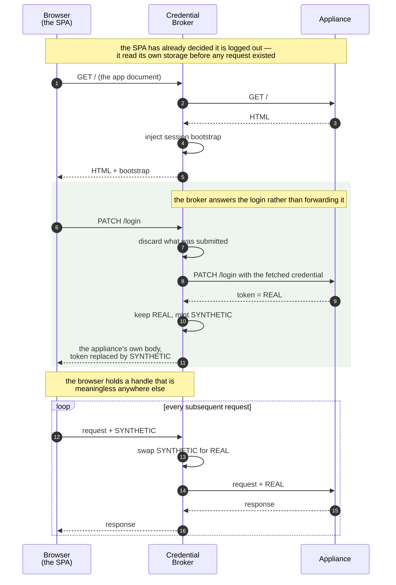
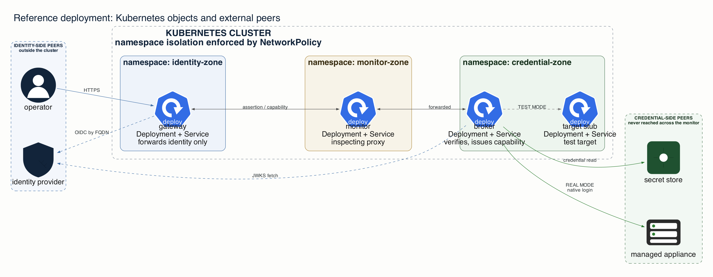

# Letting SSO reach a device that only understands passwords

An engineer signs in with single sign-on and needs the administration page of a network switch. The switch has no idea what single sign-on is — it knows a username and password, shared by everyone who administers it. Between them sits an inspection system that decrypts every connection, examines it, and keeps the recording indefinitely.

The question is simple: **how can the engineer use the switch without its shared password entering that recording?**

The claim has a deliberate boundary. The broker does not place the appliance password or real appliance session token on the inspected segment. The boundary audit verifies headers and cookies, not arbitrary request-body contents. Identity, timing, the signed identity assertion, and the broker's short-lived capability remain visible. This is a control over the intended broker path, not a promise that no caller can ever send sensitive data.

Claims marked **[M]** were measured on the running system, **[V]** read from source, **[D]** taken from vendor documentation, **[A]** are design arguments we have not tested, and **[U]** are open. The [appendix](appendix.html) explains the complete scale and what remains unresolved.

## Why is a recorded password worse than a recorded short-lived token?

Three facts, each individually reasonable:

The equipment will not change. Firewalls, switches, load balancers, storage arrays — they authenticate with a shared, long-lived password because that is what they were built to do.

The boundary will not stop recording. It decrypts and inspects for good reasons, and the records are retained and not selectively editable. Somebody fought to get it funded.

Somebody still has to manage the equipment, which means sending it that password.

The reflexive answer is that the traffic is encrypted. It is — and then it is decrypted at the boundary, deliberately, because that inspection *is* the control. Turning it off for this traffic is not a fix.

What makes this worse than ordinary "secrets in transit" is what a password does once it is sitting in an archive:

|  | A short-lived token | A password |
|----|----|----|
| Lifetime in a recording | usable until it expires, then historical | valid until someone rotates it |
| Carries an individual subject | yes, but a bearer can be replayed until expiry | no — shared |
| Revocable | expires by itself | only by changing it everywhere |

A recorded short-lived token becomes a historical artefact when it expires. A recorded password is a door that stays open until somebody notices and changes it everywhere it is used. For a shared credential on a device with no inventory of who holds it, that is a project, not a task.

Everything below follows from that one asymmetry.

## The solution in one paragraph

Put a credential broker on the switch side of the inspecting boundary. The gateway authenticates the engineer and sends the broker only a short-lived, signed statement of the engineer's identity. The broker asks the secret store whether that person may use this switch. If authorised, it obtains the shared password and uses it there, on the switch side. The password is never returned to the engineer and never crosses the inspecting boundary on the broker path.

Four different security artefacts appear in the design. Keeping them distinct makes the rest of the paper easier to follow:

| Item | What it does | Where it may travel |
|----|----|----|
| **Identity assertion** | short-lived, signed proof of who the engineer is | may cross the inspecting boundary |
| **Appliance password** | logs into the appliance; shared and long-lived | remains in the credential zone |
| **Appliance session token** | continues the real authenticated appliance session | remains with the broker |
| **Broker capability** | short-lived handle allowing one engineer to use that broker-held session | may return to that engineer |

## Why do the obvious alternatives fail?

**Give the operator the password.** Nobody knows who did anything — the device logs a shared account — and revoking one engineer means rotating a credential everything else depends on.

**Put a proxy in front and inject the password.** Half the answer. But a proxy on the near side of the boundary still sends the password across it. And for browser-facing targets, injection does not work at all; that turns out to be structural, and we come back to it.

**Exempt this traffic from inspection.** Removes a control that exists for good reasons, and in most places is not permitted anyway.

**Use a jump host.** Better for attribution. The password still lives somewhere a person can reach, and still crosses to the device.

## How does identity cross without the password crossing?

Split the path at the boundary.


The gateway authenticates the person and forwards only their identity. On the far side, a broker exchanges that identity for the device's credential and uses it there. The credential is never sent back.

Two rules carry the design:

1.  **Only expiring, bound, scoped material crosses the boundary.** An assertion may cross. A credential may not.
2.  **The secret store authorises the operator, not the broker's workload identity.**

The second rule is what makes access attributable. A secret store that authenticates only the broker's workload knows a machine asked for a credential. A store that evaluates the engineer's identity knows *who* asked.

The reference implementation delegates that identity with a bearer token: anything that steals the token can replay it until it expires. The design property is caller-aware authorization; sender-constrained delegation would be stronger than the mechanism used here. The compromise section returns to that limit. **[V]**

What the caller gets back is a **capability**, not the appliance credential. It is accepted only when presented with a valid assertion naming the same subject, against one destination, for a short time:

| Bound to | Meaning |
|----|----|
| **Subject claim** | must match the subject in a currently valid signed assertion — never an unsigned header |
| **Destination** | one target |
| **Expiry** | short, and not extendable by the holder |

One rule governs the expiry and is easy to get wrong: a capability must not outlive the assertion that authorised it. Create it for `min(capability_ttl, assertion_remaining)`. Without that minimum rule, a ten-minute capability issued against an assertion with three minutes left would create seven minutes of authorization the caller no longer holds. Both lifetime bounds show up in the deployment's own logs. **[M]**

The trap that swallows otherwise-good designs: if the credential stays put but the caller ends up holding something equivalent — a long-lived session key, a non-expiring API key — the problem moved, it did not go away.

Here is the whole lifecycle:

```mermaid
sequenceDiagram
    autonumber
    participant OP as Operator
    participant IDP as Identity<br/>Provider
    participant MON as Monitor<br/>(inspecting)
    participant BR as Credential<br/>Broker
    participant SS as Secret<br/>Store
    participant TG as Target

    rect rgb(238, 243, 250)
    Note over OP,IDP: identity zone — assertions only
    OP->>IDP: authenticate
    IDP-->>OP: assertion
    end

    OP->>MON: request + assertion
    Note right of MON: retained indefinitely.<br/>Security headers contain the assertion;<br/>arbitrary request bodies are outside the census.
    MON->>BR: forwarded

    rect rgb(237, 245, 238)
    Note over BR,TG: credential zone — fetched, used, and kept here
    BR->>BR: verify assertion
    BR->>SS: authorise as THE OPERATOR
    SS-->>BR: target credential
    BR->>TG: native login
    TG-->>BR: target session
    end

    BR-->>MON: capability
    MON-->>OP: capability

    Note over OP,BR: capability — matched to asserted subject,<br/>destination, expiry; not sender-constrained

    loop each subsequent request
        OP->>MON: request + assertion + capability
        MON->>BR: forwarded
        BR->>BR: re-verify assertion and binding
        BR->>TG: request on held session
        TG-->>BR: response
        BR-->>MON: response
        MON-->>OP: response
    end
```

On every later request, the broker re-verifies the assertion and checks that its subject matches the capability. This prevents a capability being paired with a different valid identity, but it does not stop an attacker who steals both bearer values from replaying them until expiry. Sender-constrained tokens would be needed for that stronger property.

## Which appliance authentication methods fit this pattern?

Before onboarding an appliance, ask what happens after the password is submitted. Does the appliance return a separate session token? Does it keep authentication tied to one network connection? Or must the password itself accompany later requests? Those answers determine whether sessions can be shared safely and whether this pattern applies at all.

The labels below are shorthand used by the rest of the paper:

| Class | Exchange | What you get | Broker behaviour |
|----|----|----|----|
| **A1** | yes | genuinely short-lived session | ideal — broker issues capabilities |
| **A2** | yes | session long-lived **by default** | safe only after the target is reconfigured |
| **B** | none | the credential *is* the bearer token | broker stays in-path for every call |
| **B-conn** | none | authentication binds to the **connection** | dedicated connection per caller |
| **C** | n/a | not HTTP — SNMP, SSH | outside this pattern entirely |

The vendor examples we evaluated all provide a login exchange and a separate session credential, although their default lifetimes differ: **[D]**

| Platform | Exchange | Session credential |
|----|----|----|
| PAN-OS / Panorama | `POST /api/?type=keygen` | API key → `X-PAN-KEY` |
| FortiManager | `sys/login/user` | session ID |
| F5 BIG-IP | `POST /mgmt/shared/authn/login` | token → `X-F5-Auth-Token` |
| Our target | `PATCH /api/system/login` | session token, target-supplied TTL **[M]** |

Four vendors, one recurring integration problem. For each appliance type, the broker needs five pieces of information:

1.  The login URL.
2.  The format of the login request.
3.  The field containing the resulting session token.
4.  The field reporting how long that session remains valid.
5.  The URL used to refresh it.

All five are configuration in the reference implementation. **[V]**

### How can new login formats be added without running contributed code beside the password?

The login-request format is the difficult parameter. Hardcoding it means an appliance that spells its login body differently requires a broker code change. Writing a target-specific plugin solves that scaling problem but creates a security problem: the plugin would execute beside the plaintext password and would need network access to do its job.

A safe extension mechanism needs five properties:

1.  Contributors never receive the plaintext password.
2.  Contributors cannot choose the request destination.
3.  The password appears in the request exactly once.
4.  The broker escapes the username and password for the request format.
5.  An invalid definition fails before the broker fetches a real password.

The obvious fix is to let each team contribute an adapter: a small piece of code that knows how its appliance likes to be asked. Two versions are possible, but both leave a larger review surface than the restricted description used here.

The first runs the adapter in a sandbox and lets it perform the login. That adapter necessarily receives the plaintext credential and an authorised path to the appliance, so the platform must treat contributed code as part of the credential-handling trusted base. Sandboxing can narrow its environment; it cannot make that code credential-blind while the code itself performs the login.

The second keeps the adapter credential-blind: it constructs a request containing an opaque sentinel, and platform-owned transport substitutes the credential before sending. That can be made safe, but it still runs contributed code to produce what is ultimately structured request data. For the JSON login formats evaluated here, executable code adds flexibility the use case does not need and expands what reviewers must reason about.

What survives is inverting the direction. A team does not contribute code that *performs* the login; it contributes a restricted template describing what the login request looks like. This paper calls that template a **login ceremony**:


```
{"user":"{{.User}}","password":"{{.Password}}"}
{"username":"{{.User}}","password":"{{.Password}}","loginProviderName":"tmos"}
{"id":1,"method":"exec","params":[{"url":"/sys/login/user",
  "data":{"user":"{{.User}}","passwd":"{{.Password}}"}}]}
```


Those are the reference appliance, F5 BIG-IP, and FortiManager. **[D]** The third is the awkward one — the credential nested inside a JSON-RPC envelope under a different pair of key names — and it is the case a hardcoded flat body cannot express at all. Tests render all three and assert that the credential lands in the documented position. **[V]** The complete login flow was exercised against the reference appliance; the F5 and FortiManager claims establish expressibility from their documented request shapes, not live vendor interoperability.

The security property comes from who does what. The contributor supplies the shape. The broker supplies the credential, renders the template, and owns the destination — which it builds from its own configured upstream, not from anything in the ceremony.

So consider the hostile version. A ceremony has no way to name a destination: there is no URL field in the template, and a template that writes `https://attacker.example` produces those characters as an inert string in a body already addressed elsewhere. Nothing dials it. Go's `text/template` performs no I/O, no process execution and no network calls of its own. **[V]**

That alone makes a *copy* of the credential pointless — a second copy would travel to the same place as the first. But pointless is a weaker claim than impossible, and the difference matters to whoever reviews a contributed ceremony: pointless means they must reason about where the credential got to, impossible means they need not. So ceremonies are restricted to a grammar that admits only literal text and the two substitutions, with `{{.Password}}` permitted exactly once. Anything able to repeat a value — `{{if}}`, `{{range}}`, `{{with}}`, `{{template}}`, variable bindings, pipelines that could launder a copy through a function — is refused when the ceremony is parsed, not analysed for intent. Whitelisting the two constructs we need, rather than blacklisting the ones we fear, is what keeps that true against constructs added to the template language later. **[V]**

The credential now appears in the login body once, at a position a reader can point to, and nowhere else.

That distinction is sharper than "adapters are unsafe": the danger is not contribution itself, but unnecessary executable code in the credential-handling path. The accepted grammar cannot perform I/O, choose a destination, invoke arbitrary functions, or duplicate the password. Contributors supply the shape of the request; they never touch the credential or the address.

Two smaller properties follow. A malformed ceremony is rejected at startup rather than at first login, so a shape error surfaces while nothing is at stake instead of while the broker holds the appliance password — the same reasoning as the destination guard. And the credential is escaped for its JSON string context before the template runs, so a password containing quotes or braces stays one string value instead of becoming structure. The ceremony author cannot forget to escape, because the ceremony author never sees the raw value. **[V]**

Where this stops, and the two cases are not alike. A login that is form-encoded or XML rather than JSON follows the same architectural idea, but each format needs its own parser, escaping rules, duplicate-field behavior, content type, and tests. The JSON implementation does not prove those details automatically.

A challenge-response handshake is the real boundary. There the credential is not *placed* in a request, it is *computed with* — hashed against a server nonce, say — and a template that only substitutes text cannot express a computation. Something has to run. That is precisely the adapter this section rejected, so a broker meeting such a target either implements the scheme itself, as first-party code, or admits the target is out of scope. What it should not do is accept contributed code as the way out: the moment tenant code runs beside a plaintext credential, the property that makes ceremonies safe is gone. **[A]**

**A2 is the class that will catch you.** PAN-OS documents its API key lifetime as defaulting to `0`: never expires. **[D]** A target that looks ideal — credential exchanges for a session, session goes in a header — can hand you a permanent credential instead, and now you have built a capability system on something that never expires. Reconfigure the appliance to enforce an acceptable finite lifetime, or treat it as Class B.

**B-conn breaks session sharing.** NTLM and Negotiate authenticate a *connection*, not a request; once the handshake completes the server stops challenging. There is no artefact to inject, so a transparent proxy has nothing to work with. RFC 4559 §6 also says an intermediary "must take care to not share authenticated connections between different authenticated clients to the same server" **[D]** — so these targets need a dedicated connection per caller, and concurrency at the target scales with the number of callers.

**Class C is outside the pattern.** SNMP and SSH are not HTTP and generally cannot traverse an HTTPS-only inspected boundary. No broker design here solves it; the options are relocating that tooling inside the zone, or building a purpose-built API. Targets authenticating by TLS client certificate are excluded too — the classifying question is not answerable above HTTP.

## Why do browser-based administration pages need different handling?

A command-line client can attach an authorization token to each request. Some browser applications behave differently: their own JavaScript checks cookies or browser storage to decide whether login has happened. That check happens before the browser sends an authenticated request. A header added later by a proxy is invisible to it, so the page concludes it is logged out and asks the engineer to type the very password the broker is meant to conceal. **[M]**

So the broker cannot inject. It has to *answer* the login: hold an authenticated upstream session, reply to the login request with the target's own response body but with the session token replaced by an opaque synthetic one, then swap it back on every subsequent request.

The reference implementation handles a session token stored in the response body. An appliance that establishes authentication through `Set-Cookie` needs an equivalent cookie translation: keep the real cookie at the broker, give the browser an opaque replacement, and map `Cookie` headers back on later requests. Passing an authentication cookie through unchanged would leak the real appliance session. That cookie path is not implemented here and is integration work, not another value in the current five-parameter ceremony.

That substitution is implemented in the reference. The appliance only ever sees the real token, a browser that never authenticated gets no `Authorization` header at all, and neither the password nor the real session token reaches the browser. **[V]**



Steps 7 through 11 are the substitution: the broker discards what this browser application submitted, performs its own login, and replaces the appliance's token before replying. Clients that can present authorization directly need none of this. Clients whose own login state depends on the appliance response do. Classify by client behavior, not simply “browser” versus “machine.”

## What operational burden does the broker create?

Read the diagram again and notice what it commits you to. The browser holds a token that means nothing to the appliance, so **every subsequent request has to pass through the component holding the mapping**. The broker is not a login-time helper you call once and step out of the way. It is on the request path for the life of the session, and for every session.

That makes the broker four things, not one:

- a **reverse proxy**, forwarding requests
- a **request terminator**, answering the login itself instead of forwarding it
- a **response rewriter**, parsing the appliance's own body and substituting a field
- a **stateful session mapper**, holding the browser-token-to-appliance-token mapping per person, plus an upstream session independent of any one browser request

A gateway gives you the first. The other three are code you write, and they are where the difficulty actually sits — which is why [the evaluation](gateway-evaluation.html) concludes this is not a gateway-shaped problem.

Three consequences follow, and they are the real cost of the pattern:

**It is infrastructure.** In-path for every request means an outage stops all work, not just new logins. Size it knowing it sits on the critical path for the entire estate behind it.

**It is a valuable target.** Holding a live appliance session and the ability to fetch more makes the broker a larger prize than any single capability it issues. What an attacker actually gets is set out below.

**It does not scale for free.** Our synthetic-token state is a subject-bound map in one process's memory. **[V]** State dies with the process — operators log in again — and cannot span replicas. Scaling out means moving it somewhere shared, which reintroduces exactly the keying hazard that disqualifies the off-the-shelf options: key it without the subject and it is a cross-user credential leak.

None of that argues against the pattern. It argues for one team building it and others onboarding by configuration, rather than each team writing its own — which is the recommendation in the [appendix](appendix.html).

## Where must the broker and secret store be placed?

Moving the broker to the far side feels like the whole job. It is not. If the broker then reaches back across the boundary to fetch the credential, the secret crosses in the other direction and the recording problem returns unchanged.

The secret store must be reachable from the broker without traversing the boundary. “Vault” and “secret store” refer to the same role in this paper.

## Where does each component belong?

| Zone | Contains | Rule |
|----|----|----|
| **identity zone** | operator, IdP, gateway | assertions only — never a credential |
| **monitor zone** | the inspecting middlebox | everything visible here is retained |
| **credential zone** | vault, broker, target | credentials live here and stay here |

Named this way, a credential appearing in the identity zone is self-evidently a violation. Nobody has to remember which side is privileged.

We considered "high side / low side", which is standard. The canonical usage is that high means *more sensitive* — which would put the appliance credential, the most sensitive thing here, in the zone called *low*.

The placement rule is conceptual: the gateway stays with identity, the recorder stays in the monitor zone, and the broker, secret store, and appliance-side password use stay together in the credential zone.

### How the reference deployment enforces that placement



The zones are a trust model; namespaces are what enforce it. NetworkPolicy does the work:

| Zone | Policy | What it enforces |
|----|----|----|
| identity | `identity-ingress` | operators connect from outside the cluster |
| identity | `identity-egress-via-monitor-only` | the only in-cluster egress is to the monitor zone |
| identity | `identity-egress-idp-by-fqdn` | the IdP is reachable by name, not address — it shares a host with the secret store, so an address rule would open both |
| monitor | `monitor-ingress-from-identity-only` | nothing but the identity zone may reach it |
| monitor | `monitor-egress` | forwards to the credential zone |
| credential | `default-deny-ingress` | deny first, allow explicitly |
| credential | `allow-portal-from-monitor-namespace` | the broker is reachable only through the monitor |
| credential | `allow-stub-from-portal` | the broker's test path to the target stub |
| credential | `credential-egress` | egress limited to DNS, the secret store, and the target |

In our deployment the inspected hop is plain HTTP, because the broker has no serving certificate; the measurements below were taken on that path.

The zone rule holds for the *broker path* only, not for everything in the namespace. The same rig runs an SSH path to the same appliance on which the credential is resolved into the identity zone, never crossing the monitor. **[M]** A zone rule is a claim about paths that have been moved, and it stays false for every path that has not been. That contradiction is in the [appendix](appendix.html).

## What has to be true for this to be safe?

### Could someone forge another engineer's identity?

Signature, issuer, audience, expiry, not-before — on every request, not only when the session is established. Pin the algorithm. Fetch signing keys from the issuer's published key set, cache with a bounded lifetime, refresh on an unknown key id.

The failure mode is specific: an assertion that is well-formed, unexpired, from the right issuer, and whose signature was never checked. It looks correct in every log you have.

Our first implementation had exactly that. It checked the forwarded token for shape, expiry and the presence of a subject, on the reasoning that the secret store had verified the signature at login. True of the login path. Not true of the steady-state path, which every proxied request takes.

The consequence is reachable. A capability records a subject, so it cannot be paired with a different valid identity. But if the steady-state path compares that subject against an *unsigned* assertion, the check is decorative — an observer of the boundary sees both the capability and the subject, since `sub` travels in clear, and can forge `header.{"sub":<victim>,"exp":<future>}.anything`. **[A]**

> Binding to a subject means nothing unless the claim of that subject is authenticated.

With verification on every use, a forgery carrying the correct shape, a victim subject, a future expiry, the correct issuer and audience, and the real published key id is rejected with `signature does not verify`. **[V]**

Audience is the part that is easy to leave optional, and we did at first. Unset, the check is not weakened — it is *skipped*, so a token the issuer minted for a different relying party verifies here with the correct signature and issuer. In per-user mode the broker refuses to start without it. **[V]**

### Could the password be sent to the wrong server?

The login request carries the fetched credential in its **body**. A default Go HTTP client follows up to ten redirects and, for 307 and 308, replays the method and body on each hop. So a redirect from the login endpoint hands the appliance password to whatever host the redirect names.

We wrote "refuse redirects" into this design and did not implement it. The gap survived several reviews of the document, because nobody argued against the rule — it was simply never wired in. We found it by building the counterexample: a client configured exactly as the broker's, PATCHing a login body to a server answering 307, delivered the password to the second hop intact. **[M]**

Every client that carries credential material now refuses redirects, and the regression test asserts the redirect target received *nothing* — not merely that an error came back, since an error is also what you get after a leak. **[V]** An egress policy confining the broker to known hosts is why this was survivable here; a deployment copying the reference does not inherit that policy.

Startup also refuses an implausible destination: a non-HTTP scheme, a URL with no host, or an address that is loopback, link-local, unspecified or multicast. **[V]** `url.Parse` is not a check — it accepts `file:///etc/passwd`, `javascript:alert(1)`, a bare `not-a-url` and the empty string without error, so a service configured with any of them starts and fails later, while holding the credential.

`169.254.169.254` is the case that earns the rule: the cloud metadata service would receive the appliance credential and hand back the node's identity.

The proxy also fixes the upstream URL and `Host` itself, so a caller-supplied `Host` or an absolute-form request target cannot choose the destination. **[V]**

Dial-time canonicalisation is not implemented. The check runs once, against a configured value, so a hostname that resolves to a permitted address at startup and a blocked one later is not caught. Defeating DNS rebinding means binding the resolved address in the transport at connection time. `reference/README.md` lists this among the known limits. **[A]**

### What happens when a dependency fails?

| Failure | Required behaviour |
|----|----|
| No acceptable cached signing key, cache expired, or unknown key id cannot be resolved | **Deny.** A still-valid cached key may continue verifying its known key id; never use an expired or unverified key |
| Secret store unavailable | **Deny.** No cached-credential reuse to paper over an outage |
| Target session opened but its capability record did not persist | **Close the target session.** Never leave it orphaned |
| Audit unavailable | **Deny by default.** A bounded durable spool is the only alternative |

### What happens when access is revoked?

Revoke the capability first and atomically, refuse new work, drain what was already dispatched, and end the target session only when the last capability referencing it is gone.

Shared upstream sessions are usually necessary, because many targets limit concurrent sessions — which is part of why this pattern exists. Sharing costs you something: revocation cannot undo an operation already dispatched, a shared session outlives any single capability, and compromise of one affects the whole cohort. B-conn targets cannot share at all.

### Can one caller exhaust the broker?

Being in-path for every request has a second implication beyond availability: per-subject and per-target quotas, deadlines on every dependency, bounded capability state. Without them, one tenant denies the whole estate. **[A]**

### Who renews the engineer's expiring identity proof?

The identity assertion expires, typically within the hour. Some identity systems issue a longer-lived **refresh credential** that can obtain a new assertion. Somebody has to own that refresh process, or the broker session stops working when the assertion expires.

If the broker stores that refresh credential, one condition governs whether it is safe: **it must not outlive, or be renewable beyond, the engineer's identity-provider login session.** Meet that condition and the broker gains no longer-lived identity than the engineer already holds. Miss it and the broker quietly acquires a durable impersonation credential for every caller it has served.

In the reference implementation, renewal is lazy and request-driven: it runs when an assertion is about to be used, not on a timer. **[V]** An idle broker session does not renew. Two consequences follow: renewal can be tested only by driving traffic through the path, and the identity provider is on the critical path for one request per renewal interval. Capture of the refresh state is verified; an actual renewal firing has not yet been observed. **[U]**

Decide whether renewal failure is loud or soft before you need to know. Returning the stale assertion avoids turning a recoverable expiry into an outage, but then an identity-provider failure presents as *the target* rejecting an expired token and the operator goes looking at the wrong component. If you choose soft, emit the refresh failure as its own event. **[A]**

### Can operators distinguish routine expiry from an attack?

`token expired` and `signature does not verify` are the same HTTP status to a caller and completely different events to an operator. One is routine. The other is someone attempting a forgery. If they look alike in what you emit, the second is lost in the noise of the first.

## What does an attacker get by compromising the broker?

A compromised broker can read whatever credential material is in its memory — the live target session, and anything it fetches from that point on — and can alter its own gates, scrubbing and audit. **[A]**

The appliance password is a transient local value on the login path, not a store the broker accumulates, so "every credential it ever fetched" overstates it. What it holds is the current session and the ability to fetch again while callers keep presenting assertions.

"It authorises as the caller" limits the damage only if the secret store enforces exact-path grants independently *and* the delegation is not a replayable bearer token. Our implementation does not meet the second condition: it forwards the caller's assertion to the store as a bearer token, so anything that can read it can replay it for that token's remaining life. Sender-constrained delegation would close that. **[V]**

## What did the boundary audit find that architecture review missed?

Two defects were live in a working, reviewed implementation of this pattern. Both were invisible to architecture review. Both were found by recording every header and cookie crossing the inspected network segment.

**The gateway's own session cookie was crossing on every request observed at the time.** **[U]** The broker fronted its targets on its own origin, so the browser attached the gateway's session cookie to every request and the proxy forwarded it verbatim. Nothing downstream read it. It was an unbound 24-hour bearer for the gateway itself — and the gateway could reach targets whose credentials resolve on the trusted side.

The boundary was carrying something more valuable than the secret the design existed to protect.

The fix strips it by matching name and value together. Matching the name alone breaks a second gateway deployed behind the first, which legitimately uses the same cookie name.

On the current deployment, across **469 consecutive requests** with the monitor proxying to the real broker, **0 carried the gateway's session cookie.** The target's own cookies passed through untouched: 308 requests carried all five (`accepts-cookies`, `null`, `publicKeyId`, `publicKeyIdSignatureBase64`, `ui_lang`) and 161 carried the two the browser had at that point in the session. **[M]**

That second number matters. "The target's five cookies were preserved" would have been tidier and false — cookie sets vary by session phase. What is being claimed is that the broker passes the target's cookies through as presented and strips the gateway's.

**An unsigned identity header was crossing on every request observed at the time. [U]** The broker injected a header carrying the same identity as the token, but unsigned, with no way to disable it. Worse than redundant: the receiving service *authorised* on the signed token and *attributed its audit log* to the unsigned header. Authorisation used the strong channel, attribution used the weak one — and the audit log is the artefact everyone reaches for after an incident.

Attribute from the verified token, and suppress those headers wherever a signed token is present.

Two testing lessons came out of that work. Here are the terms before the lessons:

- A **watchlist** checks only a predetermined set of header or cookie names.
- A **full census** records every header and cookie name, then classifies what it found.
- A **stub** is a test substitute for the real downstream service.
- A **response-side signal** is proof that the request reached the intended downstream service and returned through the complete path.

> **A watchlist proves presence, never absence.** Instrumentation watching five named headers can tell you those five were absent. It says nothing about the sixth — which is exactly the claim being made. Only a full census answers it.

> **Boundary observations are recorded before forwarding.** They look healthy even when the downstream has been replaced by a stub. Header evidence can prove a leak; it cannot prove a chain works. A run is only valid alongside a response-side signal.

We learned both the hard way. A five-header watchlist reported a clean boundary while a full census found an unwatched header on every request, and a re-applied manifest silently repointed the monitor at a stub while the observations went on looking correct. **[M]** The rules that follow from those two incidents are inference, not measurement. **[A]**

## How do you add a new appliance safely?

1.  Classify its authentication behavior using the table above. If it is Class C, stop — this pattern does not cover it.
2.  If it returns a separate session (Class A1 or A2), determine where that session is carried. For the supported response-body form, record the login URL, login-request format, session-token field, session-lifetime field, and refresh URL. The login-request format is the ceremony; `reference/README.md` documents its grammar and gives three complete examples. If authentication is carried in `Set-Cookie`, the current implementation does not support it: add explicit cookie rewriting and opaque cookie state before onboarding the target.
3.  For Class A2, reconfigure the appliance to enforce an acceptable finite lifetime. If that is impossible, handle it as Class B.
4.  For Class B, design the broker to remain in-path for every use of the bearer credential; the five-value login exchange does not apply. For B-conn, allocate a dedicated authenticated connection per caller rather than sharing a session.
5.  Determine whether the client can present authorization directly or whether its own login state depends on the appliance response. Only the latter needs login-response translation.
6.  Create an **access grant**: which people may use the appliance, which destination they may reach, and how long their broker capability lasts. This is different from the refresh credential discussed in the renewal section.
7.  Run the conformance test against the new path. Require a full boundary census, a successful response from the intended downstream service, and a check that no real authentication token or cookie reaches the client.

Effort scales with distinct login *protocols*, not device count. Another appliance using a JSON request-and-session exchange is configuration, even when its field names and nesting differ. A new serialization or challenge-response protocol is integration work. **[A]**

## What you get, and what you do not

On the intended broker path, it keeps the appliance password and real appliance session token out of the boundary's headers and cookies. It makes access attributable at the broker and secret-store layers because authorization is evaluated for a person rather than only a machine. It makes broker access short-lived and individual.

It does not guarantee nothing sensitive ever crosses. The broker does not read request bodies and does not restrict what a caller puts in one. Against a careless or hostile caller this is a partial control.

It does not cover equipment that cannot speak through the boundary at all — SNMP, SSH, anything not HTTP.

It does not hide who is asking. The boundary still sees identity and timing. Identity is not a secret that expires.

**The boundary test is the part to take even if you never build the broker.** Census every header and cookie name that crosses — not a watchlist, which can only speak to the headers it was told to watch. Drive a probe carrying the credential you expect to be stripped, because a chosen input proves more than passive observation. Require a response-side signal, because observations are recorded before forwarding and look healthy against a stub.

That test is what exposed two defects architecture review had missed. Both are closed in the reference: it strips the gateway's cookie and the unsigned identity header before the request leaves, and attributes from the subject the secret store established rather than from a header anybody could set. **[V]** The cookie fix on the gateway side was contributed upstream and is not in this repository. **[U]**

Across 469 consecutive requests, the audit found none of the prohibited material in headers or cookies: no appliance password, real appliance session token, gateway session cookie, or unsigned identity header. The permitted signed assertion, opaque broker capability, and ordinary appliance cookies still crossed as designed. Request-body contents were not examined. **[M]** The test costs a day to build, works against implementations you did not write, and is worth having whether or not anybody funds the broker.

------------------------------------------------------------------------

**Further reading.** Whether an API gateway you already own can do this instead is a fair first question: we assessed Kong and Apigee against the requirements this implementation produced in [gateway evaluation](gateway-evaluation.html) — both can host a broker, neither supplies the parts that make it hard. The [appendix](appendix.html) has the conformance method, the residual risks, and what is still open. The reference implementation is under `reference/` in this repository.
