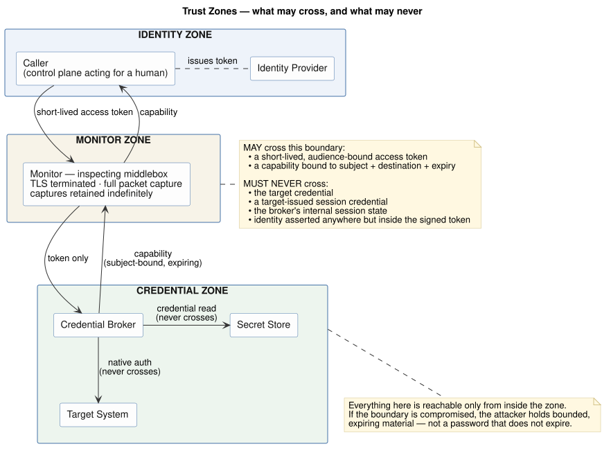

# Brokered credential access across an inspecting boundary

An engineer needs to change a firewall rule. The firewall knows one way to authenticate: a username and a password, shared by everyone who administers it. The engineer has a modern identity — single sign-on, a token that expires in an hour. Between them sits a device that decrypts every connection, inspects it, and keeps a copy.

Somewhere in that arrangement, a password crosses a recorder.

> A recording of a short-lived token becomes an artefact when the token expires. A recording of a **password** remains a key until somebody rotates it.

That asymmetry is the whole problem. A captured short-lived token may remain useful until it expires. A captured shared password remains useful until somebody rotates it, potentially long after the original session.

The question is simple: **how can the engineer use the appliance without its shared password crossing — or being stored by — the inspecting device?**

## The solution, in plain terms

Put a credential broker on the appliance side of the inspecting boundary.

1.  The engineer signs in through the company's normal single sign-on.
2.  The access gateway — the service in front of the appliance — sends the broker a short-lived, signed statement saying who the engineer is.
3.  The broker asks the secret store whether that engineer is allowed to use this appliance.
4.  If the answer is yes, the broker obtains the shared appliance password and uses it there, on the appliance side of the boundary.
5.  The password is never sent to the engineer and never crosses the inspecting boundary.

The secret store authorises **the person, not merely the broker service**. That distinction preserves attribution: the access record says which engineer requested the appliance, not just which server made the network call.



Three network zones make the rule visible:

- **Identity zone:** authenticates the engineer.
- **Monitor zone:** decrypts, inspects, and records traffic.
- **Credential zone:** contains the broker, access to the secret store, and the appliance-side use of the password.

The central rule is now easy to state: the shared appliance password must never appear in the identity or monitor zone.

## What the engineer experiences

<video controls muted playsinline preload="metadata" width="100%"
       style="max-width:900px;border:1px solid #eaecef;border-radius:6px;">
  <source src="demo.mp4" type="video/mp4">
  Your browser cannot play embedded video.
  <a href="demo.mp4">Download the recording</a> instead.
</video>

The engineer signs in with single sign-on, selects the appliance, and reaches its administrative interface — **without ever receiving or typing the appliance password.** The broker completed the appliance login on the other side of the boundary.

The appliance's own login form never appears. The engineer's display name and the device's serial number, MAC address, and network address are blurred in the recording; nothing else is edited.

## How a browser session works

The appliance does not understand the engineer's company identity. It understands only its own login request and the session token it returns after a successful login.

The broker bridges those two systems:

1.  It verifies the engineer's signed identity on every request.
2.  It obtains the appliance password only after the secret store authorises that engineer.
3.  It sends the appliance's normal login request from inside the credential zone.
4.  It keeps the appliance's real session token and gives the browser a new, short-lived opaque token instead.
5.  On later requests, it replaces the browser's opaque token with the real appliance session token before forwarding the request.

The opaque browser token is useful only through this broker, for this engineer and this appliance. Possessing it does not reveal the password or the appliance's real session token.

This extra step is necessary for browser-based administration pages. Adding an `Authorization` header to proxied requests is not enough: the page's own JavaScript often checks browser storage before making a request. If it finds no login state there, it displays the appliance login form and asks the engineer for the password. The broker avoids that prompt by completing the appliance login and answering the browser with the appliance's expected response shape.

## Adding another appliance without writing broker code

Different appliance types expect different login requests. One may accept `user` and `password`; another may expect `username`, `password`, and a provider name; a third may nest both values inside a JSON-RPC message.

The obvious implementation is to write a new login adapter for every appliance type. That scales poorly, and it creates a security problem: each adapter would run as code beside the plaintext password and would need network access to do its job. A faulty or malicious adapter would therefore have everything it needs to send that password elsewhere.

The broker uses configuration instead. For each appliance type it needs five protocol values:

1.  The login URL.
2.  The format of the login request.
3.  The field in the response that contains the appliance session token.
4.  The field that says how long the session remains valid.
5.  The URL used to refresh the session.

Onboarding also requires an **access policy**. The secret store decides which engineers may obtain the appliance password; the broker binds the resulting access to one destination and a short lifetime. The five protocol values describe how the appliance login works. The access policy describes who may use it and under what limits.

The login-request format is a restricted template called a **login ceremony**. It describes the request body; it is not code that performs the login.

For the appliance used to test this reference implementation, the ceremony is:


```json
{"user":"{{.User}}","password":"{{.Password}}"}
```


The broker inserts the configured username and the password obtained from the secret store. The template may contain literal text plus those two substitutions only, and the password must appear exactly once. It cannot run functions, make network calls, duplicate the password, or choose where the request is sent. The broker owns the destination.

The same mechanism also expresses more involved vendor formats:


```json
{"username":"{{.User}}","password":"{{.Password}}","loginProviderName":"tmos"}

{"id":1,"method":"exec","params":[{"url":"/sys/login/user",
  "data":{"user":"{{.User}}","passwd":"{{.Password}}"}}]}
```


Those are the documented shapes for F5 BIG-IP and FortiManager. The second nests the values inside a JSON-RPC request. Tests confirm that both documented request shapes can be rendered through configuration alone. The complete login flow was exercised against the appliance used by the reference deployment.

## What we validated for security

The security goal is narrower and more useful than “the system looks healthy”:

> Across the inspected boundary, the permitted security material is short-lived and individually bound: the signed identity statement and the broker's opaque browser token. The shared appliance password, the appliance's real session token, and the access gateway's login cookie — the cookie that keeps the engineer signed into the gateway itself — must not appear there.

We tested that goal in four ways.

### 1. We recorded everything crossing the boundary

The audit recorded every header and cookie name, rather than checking only a predetermined list. A predetermined list can confirm that the names on the list were absent; it cannot detect a sensitive value under a name nobody thought to list.

On the measured deployment, prohibited credential material appears in headers or cookies on **0 of 469 consecutive requests**. The permitted identity statement, opaque broker token, and appliance's ordinary preference and UI-state cookies continue to pass as expected.

Request-body contents were not recorded, so the boundary audit alone does not prove that a password never appears in a body. That part of the claim has separate evidence: source tests show that the password is inserted only into the platform-owned login request, the broker refuses redirects and owns the destination, and the end-to-end test confirms that this request reaches the intended appliance and produces a working session.

The audit also requires a successful response from the far side. Without that response, a disconnected broker or a temporary test replacement for the real service could make the observed boundary look perfectly clean simply because the request never completed the intended path.

### 2. We tried to impersonate another engineer

A forged identity statement had the right shape, victim identity, issuer, audience, expiry, and published signing-key identifier — but not a valid signature. The broker rejected it with `signature does not verify`.

This test matters because checking identity only at login is insufficient. The broker verifies the signed identity again on every use of the browser's opaque token.

### 3. We tested whether the password could be redirected

The first implementation followed HTTP redirects on the login request that carries the appliance password. A `307` or `308` response could therefore replay the same method and body to another server.

The broker now refuses redirects on every request that can carry a credential. A regression test confirms that the redirect destination receives nothing.

### 4. We proved the clean boundary belonged to a working end-to-end path

The running deployment was exercised end to end: single sign-on, authorization by the secret store, the declarative login ceremony against the real appliance, creation of a five-minute appliance session, and issuance of a separate short-lived browser token. This prevents a disconnected broker or test replacement from producing a deceptively clean boundary simply because the intended request path never ran.

## How claims are labelled

The detailed documents label each claim by how it is known: **[M]** measured, **[V]** verified from source, **[G]** verified through the GitHub API, **[D]** vendor documentation, **[C]** community or practitioner evidence, **[A]** reasoned but unverified, and **[U]** open question. The [appendix](appendix.html#how-the-claims-are-marked) contains the complete definitions.

The overview omits most markers so the explanation remains readable. The detailed pattern and appendix retain them at claim level.

## Limits

This is a reference implementation, not a product.

- The broker must remain behind the gateway and in the credential zone, enforced by network policy.
- One real appliance session is shared across engineers. The broker preserves per-person authorization and audit at its own layer, but the appliance may see the shared account.
- The implemented ceremony format describes JSON login bodies. Form and XML bodies need different escaping; challenge-response schemes require first-party broker code or must remain out of scope.
- SNMP, SSH-only targets, and other non-HTTP protocols are outside this pattern.
- The boundary audit covers header and cookie contents, plus body sizes; it does not inspect request-body contents.

## Further reading

- **[The detailed pattern](credential-broker-pattern.html)** — design reasoning, implementation requirements, and the full evidence record.
- **[Reference implementation]({{ site.github.repository_url }}/tree/main/reference)** — broker source, ceremony grammar and tests, and a deployable example with all five appliance parameters set explicitly.
- **[Gateway evaluation](gateway-evaluation.html)** — whether Kong or Apigee can provide the required behavior. Both can host a broker; neither supplies the difficult parts itself.
- **[Appendix](appendix.html)** — conformance method, residual risks, claim markers, operations, and open questions.

Identifiers throughout are documentation placeholders (`example.internal`, RFC 5737 addresses). Nothing here is a live endpoint.
